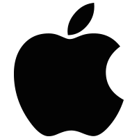

## Le Wagon Copenhagen

### Weekend Workshop setup

Setup guides made for the Wondercoders & Le Wagon Ruby workshop from [Le Wagon](https://www.lewagon.com/copenhagen).

Please choose your operating system (OS):

<table>
  <tr>
    <td>
      <h2>Apple</h2>
      
    </td>
    <td>
      <h2>Windows</h2>
      
    </td>
  </tr>
</table>
