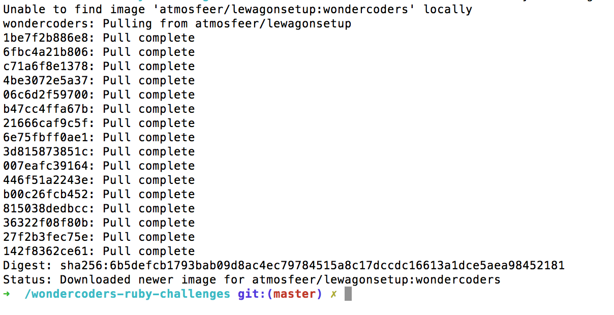

## Le Wagon Ruby Workshop setup - MacOS

### Step 1: Download Sublime Text
Download and install [Sublime Text](https://www.sublimetext.com/3).

This is the text editor where you'll be writing your code.

### Step 2: Download Docker
Download and install [Docker](https://store.docker.com/editions/community/docker-ce-desktop-mac) here.

Instead of downloading Ruby and setting it up on your laptop, we will use a virtualization tool to simulate a Linux developer environment for a lightning quick setup. Docker will handle that for us.

### Step 3: Start Terminal
Open the Terminal (click the magnifying glass icon in the top right corner of your screen and type Terminal):


The Terminal is a very important tool for developers, as it allows you to launch tasks very quickly. Most developer tools don't have Graphical User Interfaces and run exclusively in the terminal. You'll use some of them today.

### Step 4: Create folder and download challenges
Copy paste these lines one at a time into your Terminal, pressing enter after pasting each one:

```bash
  cd ~ && mkdir code && cd code
  open .
```

This will open a Finder window with at the empty code folder you just created in the terminal.

Now you need to download the challenges [using this link](https://www.dropbox.com/sh/8r8h7ltg4w4mzuj/AAAO5vjREjB5SzL2vC1QnZ4ta?dl=1) and copy that zip file in your code folder. Then, unzip the zip.

**Don't close this Finder window, you'll need it later.**


### Step 5: Run Docker

Make sure Docker is running first. An icon of a whale should appear top right on your computer, looking like this:


If not, just click the magnifying glass and type Docker to start the application.

Copy paste this long line in your terminal to start the Ruby Virtual Environment.

```bash
docker run -it -v ~/code/wondercoders-ruby-challenges:/wondercoders-ruby-challenges atmosfeer/lewagonsetup:wondercoders /bin/zsh
```

This will take a couple of minutes as your computer needs to download the full virtual environment.

When you're done, it should look something like this:




**You're all set to start coding now.**

From now on, whenever you want to work on the challenges, all you need to do is to run this last line from the  Terminal. So copy and paste it somewhere you'll be able to find easily.

### Step 6: Navigate to your challenges and open them in Sublime

Go to the code folder in your Finder. Find the folder containing the first challenge and drag and drop it into Sublime. You're now ready to code!
