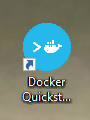
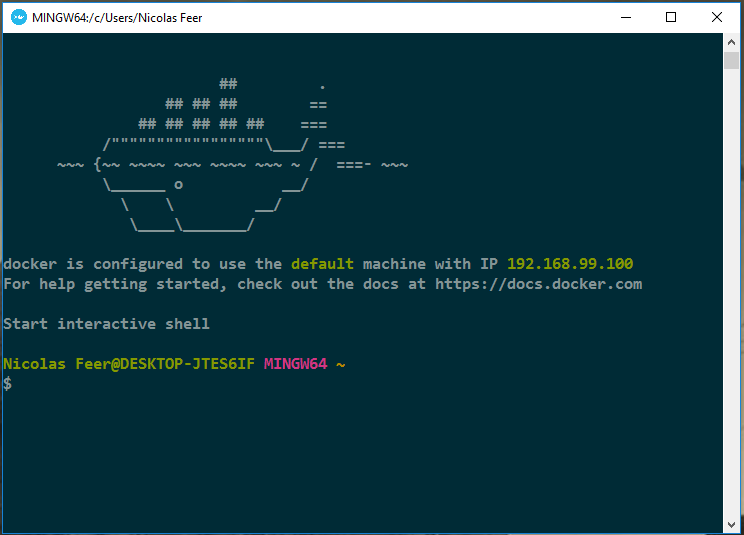
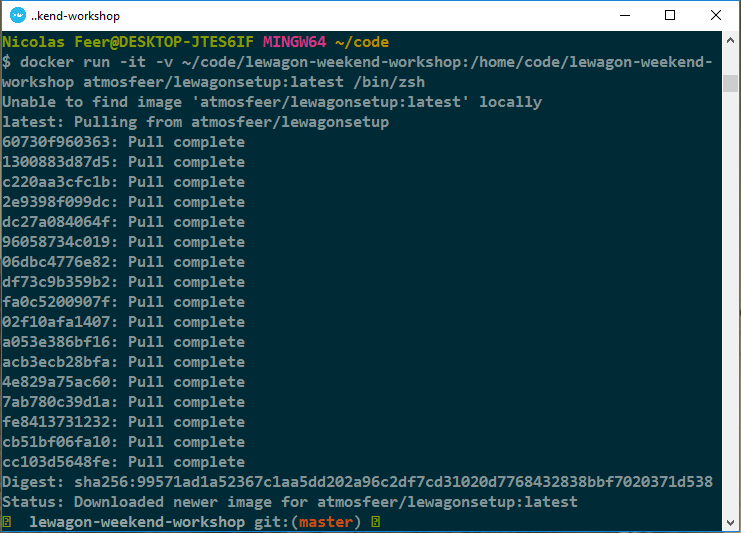
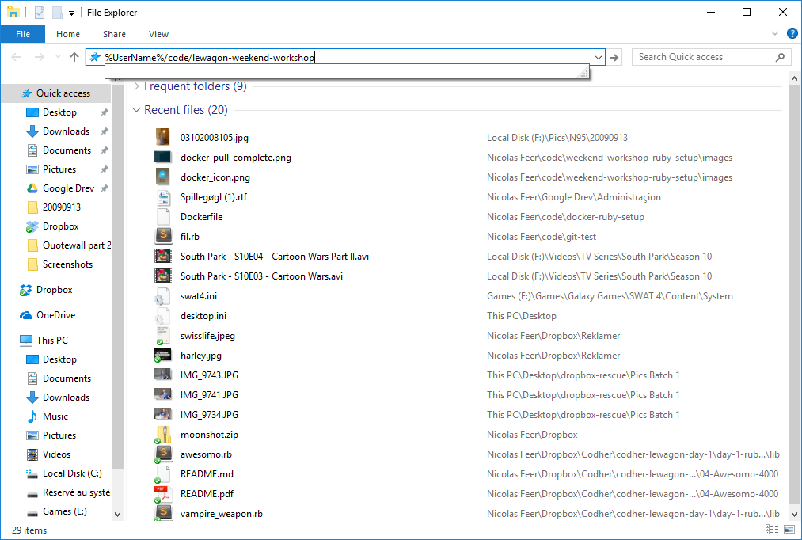

## Le Wagon Ruby Workshop setup - Windows

### Step 1: Download Sublime Text
Download and install [Sublime Text](https://www.sublimetext.com/3).

This is the text editor where you'll be writing your code.

### Step 2: Download Docker Toolbox
Download and install [Docker Toolbox](https://docs.docker.com/toolbox/toolbox_install_windows/) here. Just leave the default boxes ticked and click next until the installation process begins.

As writing in Ruby on Windows poses many problems, we will use a virtualization tool to simulate a Linux developer environment. Docker will handle that for us.

### Step 3: Start Docker Terminal
Run the docker quickstart Terminal, there should be a shortcut on your Desktop which looks something close to this:




It will install and download the additional modules that are necessary. Accept the prompts asking about Virtualbox modules.

The Docker Quickstart Terminal is where you'll be able to write commands and run Ruby code just like you could if you had a Linux or Mac machine.

When you're done it should look something like this:



<span style="color: #d23333">*If you get an error here, you need to enable CPU Virtualization. It's a lot less scary than it sounds, just ask a teacher.*</span>

### Step 4: Create folder and download challenges
Copy paste these lines one at a time into your Docker Terminal, pressing enter after pasting each one:
```bash
  cd ~ && mkdir code && cd code
  git clone https://github.com/atmosfeer/wondercoders-ruby-challenges.git
```

This step is pretty simple. We create new empty folders on your computer and download the challenges of the workshop into them using git.

### Step 5: Run Docker Container
Copy paste this long line to start the Ruby Virtual Environment. This will take a couple of minutes as your computer needs to download the full virtual environment. Lucky for you, the internet at Le Wagon is pretty sweet.

```bash
docker run -it -v ~/code/wondercoders-ruby-challenges:/wondercoders-ruby-challenges atmosfeer/lewagonsetup:wondercoders /bin/zsh
```

When you're done, it should look something like this:




**You're all set to start coding now.**

From now on, all you need to do is to run this last line from the Docker Quickstart Terminal whenever you want to work on our challenges.

### Step 6: Navigate to your challenges and open them in Sublime

Press `Windows Key + E` to bring up windows explorer.
Press F4 to go to the address bar.
Copy paste this line:

`%UserName%/code/wondercoders-ruby-challenges`




Navigate to your current challenge and drag and drop the relevant folder into Sublime. Code away!
